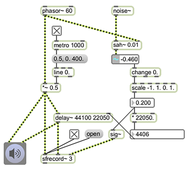
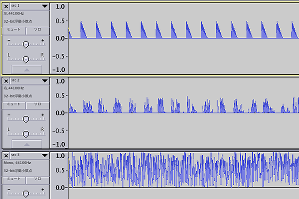

# AIFF

multi track aiff read / write utility.

## usage

#### read (3rd track)

	AIFF::Buffer *buffer = AIFF::read(DESKTOP_PATH(@"src.aif"),2);
	
#### write

	long channels = 1;
	long length = buffer->length*channels;
	unsigned short *data = new unsigned short[length]{0};
		
	for(int k=0; k<buffer->length; k++) {
		data[k*channels+0] = AIFF::to(buffer->data[k]);
	}

	AIFF::write(DESKTOP_PATH(@"dst.aif"),buffer->data,length,channels);

## example

#### Max/MSP

export track

1. raw signal
* delayed signal
* delay parameter

#### Audacity

*Audacity can not open multi track .wav.
